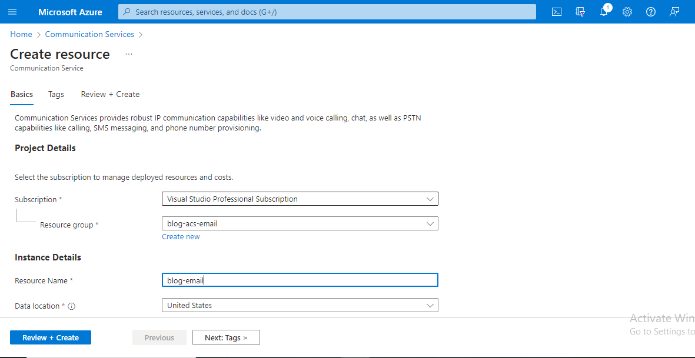
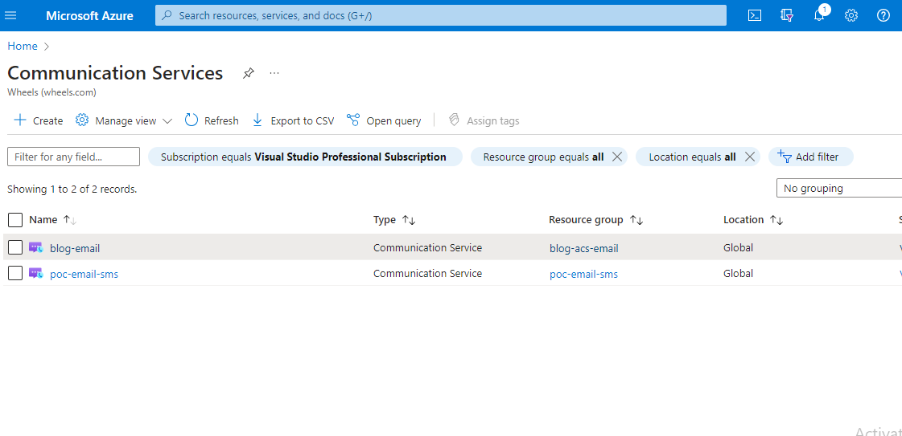
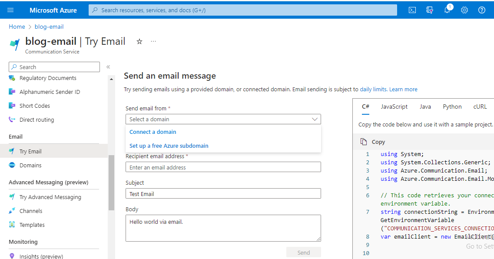
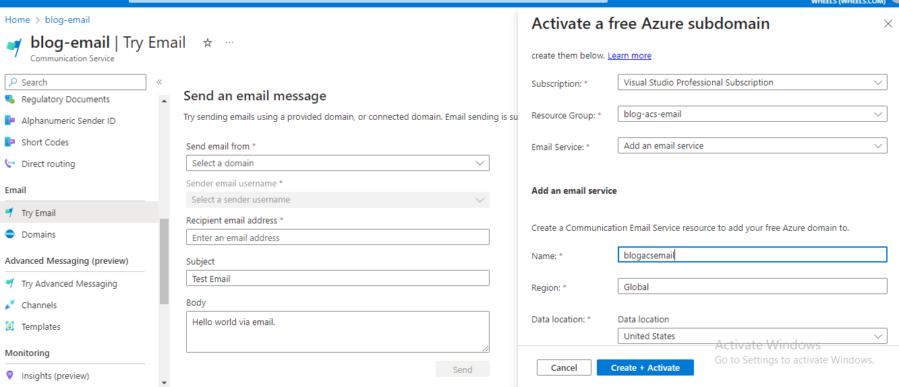
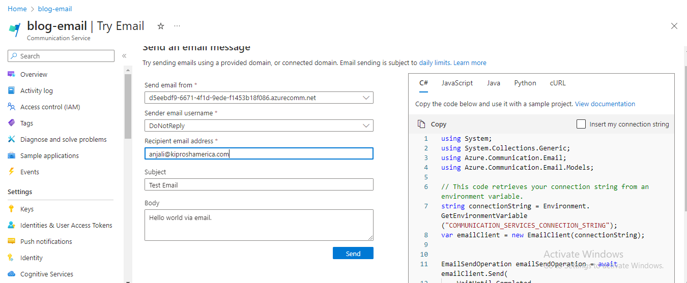

In today's business landscape, email functionality plays a vital role in both marketing and business operations. With the increasing automation in CRM applications, there is a growing necessity for features that facilitate seamless communication, allowing businesses to effortlessly send emails to their customers. This article will provide a step-by-step guide on implementing email functionality in your CRM using the Azure Communication SDK.


## Setup Azure Communication Service on Azure Portal
- Go to the Azure Portal, search for `Communication Service`, and create a new Azure Communication Service resource named `blog-email`.



- After creating the service, it will take some time for deployment. Once completed, you'll be able to locate our new service under Communication Services with the name `blog-email`.



- Go to the `blog-email` service, where you will find the `Try Email` option; click on it.



- You have the option to link an existing domain for sending emails or acquire a new domain from Azure for this purpose. Refer to this post for detailed instructions on setting up a custom domain: [Setup Custom Domain](https://learn.microsoft.com/en-us/azure/communication-services/quickstarts/email/add-azure-managed-domains).

- In this blog post, we'll be establishing a free Azure Domain, and the initial step involves creating an email communication service resource.


- After setting up the domain, it will be visible in the dropdown list, and the sender name will be listed as `DoNotReply`.


We've configured the Azure Communication service for sending emails. Now, let's see how to integrate it into our application.

## Send emails in c# application

- Install `Azure.Communication.Email` nuget package in your c# application

The following code snippet illustrates how to establish a connection to Azure Communication Service and send emails.

```c sharp: EmailServices.cs
using Azure;
using Azure.Communication.Email;
using System;
namespace ACSDemo.Services
{
        public class EmailModel {    
                public string Recipient { get; set; }
                public string Subject { get; set; }
                public string HtmlContent { get; set; }
                public string PlainText { get; set; }
        }

        public class EmailServices
        {
                private readonly string _smsConnection;
                private readonly string _sender;
                public EmailServices() {
                // Get the connection string from portal
                _smsConnection = Environment.GetEnvironmentVariable("SMSConnectionString");               
                // Get the sender email: DoNotReply@domain
                _sender = Environment.GetEnvironmentVariable("SenderEmail");            
                }

                private EmailClient GetEmailClient() { 
                // Get the Email Service client instance for connection string         
                return new EmailClient(_smsConnection);
                }

                public async Task  SendEmailAsync(EmailModel model) { 
                var  client= GetEmailClient();
                // Send email 
                await client.SendAsync(
                        WaitUntil.Completed,
                        _sender,model.Recipient,model.Subject,model.HtmlContent,model.PlainText);

                }
        }
}
```
This approach allows us to seamlessly integrate email functionality into our application.

**References**:
1. [Sending Emails with Attachments](https://learn.microsoft.com/en-us/azure/communication-services/quickstarts/email/send-email-advanced/send-email-with-attachments)
2. [Azure Email Communication Services ](https://learn.microsoft.com/en-us/azure/communication-services/quickstarts/email/create-email-communication-resource)
3. [Add Azure Managed domain to Azure Email Communication Services](https://learn.microsoft.com/en-us/azure/communication-services/quickstarts/email/add-azure-managed-domains)


