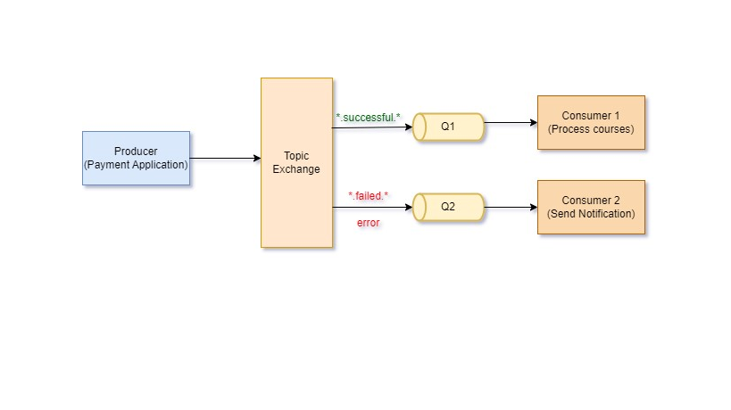

## Publish/Subscribe messaging model using RabbitMQ

RabbitMQ is widely used open-source message broker. Businesses that use the microservices model can use this tiny piece of software to connect and communicate between their services.This blog post will explain how to incorporate pub/sub messaging into applications.

## Prerequisites

Here I am assuming you have already setup RabbitMQ on your machine. If not you can follow this blog post to setup.
https://codenotfound.com/rabbitmq-download-install-windows.html

## Terminologies
- **Producer**: An application which creates and sends message to RabbitMQ broker. It publish message to the exchange
- **Exchange**: A component of RabbitMQ which directs messages to Queue. There are multple exchange type in RabbitMQ. 
- **1.Direct** : 1:1 messaging to qeueue
- **2.Fanout**: Broadcasting messages to all the queues which are bind to the exchange.
- **3.Topic** : A message sent with a particular routing key will be delivered to all the queues that are bound with a matching binding key.   
In this article we will talk Topic Exchange.

- **Queues**: It stores the messages.
- **Bindings**: It binds exchange and queue. Based on the binding the exchange publishes the message to specific queue. 
- **Consumer**: An application responsible for receiving and processing messages from a queue

The pub/sub pattern works as follows: the publisher sends a message to the message broker, who then routes the message to all subscribers who have expressed an interest in receiving it. Subscribers do not need to be aware of the publisher and vice versa. The message broker act as an middleware that decouples the two.

Consider a scenario in which a user purchases Learning Path having multiple courses from a Udemy. The user places the order, and the payment request is sent to the payment gateway.
In this case, the payment request can be successful, unsuccessful, or error. Each status has a unique scenario. If the payment is successful, we want to assign courses to the user. If a payment fails or an error occurs, we want to notify the user and provide a link to fix the payment. In this case, we would have three applications : payment gateway(Udemy site), CourseAssignment application, and Notification Apllication.
The payment gateway will publish a message to exchange with the status. Payment status will serve as a routing key, and the exchange will route messages to queues based on the routing key/binding.



## Setup RabbitMQ connection

```c sharp:PaymentGateway.cs
        var _factory = new ConnectionFactory { HostName = "localhost" };           
        var connection = _factory.CreateConnection();                                
        var _channel = connection.CreateModel();                                          
```
## Declare Exchange

Declare paymentexchange with Topic as ExchangeType.

```c sharp:PaymentGateway.cs
        _channel.ExchangeDeclare(
                    exchange: "paymentexchange",
                    type: ExchangeType.Topic)
```

## Declare Queue

Declare queue for status Payment successful and for failure/error notification queue. 

```c sharp:PaymentGateway.cs
       // Queue for payment successful
        _channel.QueueDeclare(queue: "payment_success",
                         durable: false,
                         exclusive: false,
                         autoDelete: false,
                         arguments: null);
        // Queue for payment failure or error in processing
        _channel.QueueDeclare(queue: "notification",
                         durable: false,
                         exclusive: false,
                         autoDelete: false,
                         arguments: null);
```
## Bind Queue

Bind queue to routingKey and exchange. A queue can be bind to single or multiple routingKey as well. 
`payment_success` is bind to `routingKey=*.successful.*`. Below mentioned are few examples of routingKey which would be routed to this queue.
-payment.successful.assign.courses
-successful.assign.courses
-payment.order.successful.assign.courses

Notification queue is bind to `routingKey=*.failed.*`. In this case messages with following routingKey key would be send to 
-payment.failed.notify
-failed.revert.demo
-failed

Notification queue is also bind to `routingKey=error`. In this case the routingKey allowed is `error` only.

```c sharp:PaymentGateway.cs
_channel.QueueBind(queue: "payment_success",
                      exchange: "paymentexchange",
                      routingKey: "*.successful.*")

_channel.QueueBind(queue: "notification",
                      exchange: "paymentexchange",
                      routingKey: "*.failed.*")
_channel.QueueBind(queue: "notification",
                      exchange: "paymentexchange",
                      routingKey: "error")
```
## Publish message by publisher 

```c sharp:PaymentGateway.cs
_channel.BasicPublish(exchange: "paymentexchange",
                             routingKey: "payment.successful",
                             basicProperties: null,
                             body: Encoding.UTF8.GetBytes("Payment is successful process courses"))

_channel.BasicPublish(exchange: "paymentexchange",
                             routingKey: "payment.failed",
                             basicProperties: null,
                             body: Encoding.UTF8.GetBytes("Please redo the payment"));

_channel.BasicPublish(exchange: "paymentexchange",
                             routingKey: "error",
                             basicProperties: null,
                             body: Encoding.UTF8.GetBytes("Unable to process payments"));

```  
## Declare Consumer
In AssignCourses application declare a consumer which is listening to `payment_success` queue. On receiving this message application will assign courses to the user.
```c sharp: AssignCourses.cs
// setup rabbitmq client and get channel
var consumer = new EventingBasicConsumer(channel);
consumer.Received+=(model, ea) =>
        {
           // get data and assing courses
        };
_channel.BasicConsume(queue: "payment_success",
                                 autoAck: false,
                                 consumer: consumer)
      
```

```c sharp: NotificationApp.cs

In Notification application declare a consumer which is listening to `notification` queue. On receiving message on payment failure or error, this will notify user with link to re-do payment for order.
// setup rabbitmq client and get channel
var consumer = new EventingBasicConsumer(channel);
consumer.Received+=(model, ea) =>
        {
          // Send notification with link to re-do payments
        };
_channel.BasicConsume(queue: "notification",
                                 autoAck: false,
                                 consumer: consumer)
      
```
## Conclusion

In this way we can implement pub/sub messaging model using RabbitMQ  topic exchange to do inter communication between applications. 
